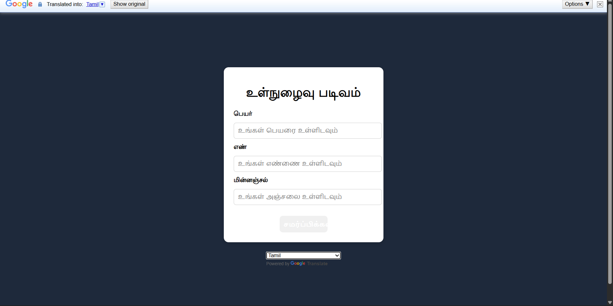

# Login Form with Google Translate

This project is a simple **login form UI** built using **HTML, CSS, and JavaScript**, with **Google Translate integration** to support multiple languages.  
It focuses on clean UI design, basic form structure, and using an external JavaScript library.


## 📌 Overview

A simple front-end project showcasing a clean login form UI built with HTML, CSS, and JavaScript.
It includes Google Translate integration to enable multilingual support for the page content.
The project focuses on basic form structure, UI clarity, and using an external JavaScript library for language translation.


## 🛠️ Technologies Used

- HTML5
- CSS3
- JavaScript (Vanilla JS)
- Google Translate API


## 📁 Project Structure

login-form-google-translate/
│
├── index.html
├── style.css
└── script.js


## ✨ Features

- Clean and responsive login form UI
- Fields for name, number, and email
- Google Translate dropdown below the form
- External JavaScript file for better structure
- Beginner-friendly and readable code


## 🚀 How to Run the Project

1. Clone the repository  
   ```bash
   git clone https://github.com/dinishsg/login-form-google-translate.git
2. Open index.html in any web browser.


## 📸 Screenshots 

   


## 🌐 Live Demo 

🔗(https://dinishsg.github.io/login-form-google-translate/)
